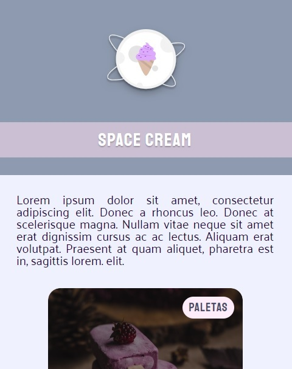
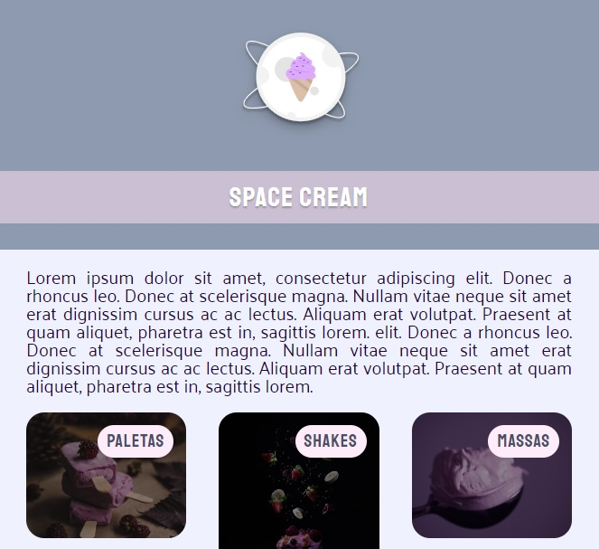
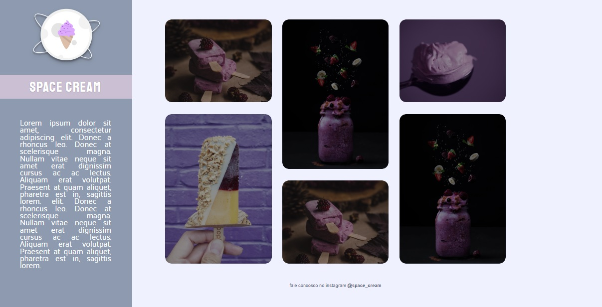

<h1 align="center"> Recriating Layout: Space Cream </h1>

Layout reacriation was started by coding the mobile version, then creating the changes for tablet and computer versions. It has animations, responsivity,  transition and transformation, clamp funcion and relative measures and more.  

  <a href="#-technologies">Technology</a>&nbsp;&nbsp;&nbsp;|&nbsp;&nbsp;&nbsp;
  <a href="#-project">Project</a>

  &nbsp;

  

## 🚀 Technologies

This project was developed using the following technologies:

- HTML
- CSS
- Git e Github
- Figma

## 💻 Project

- [Visit the online project](https://pedrohfaig.github.io/space-cream)

---

Developed by Pedro Henrique Faig